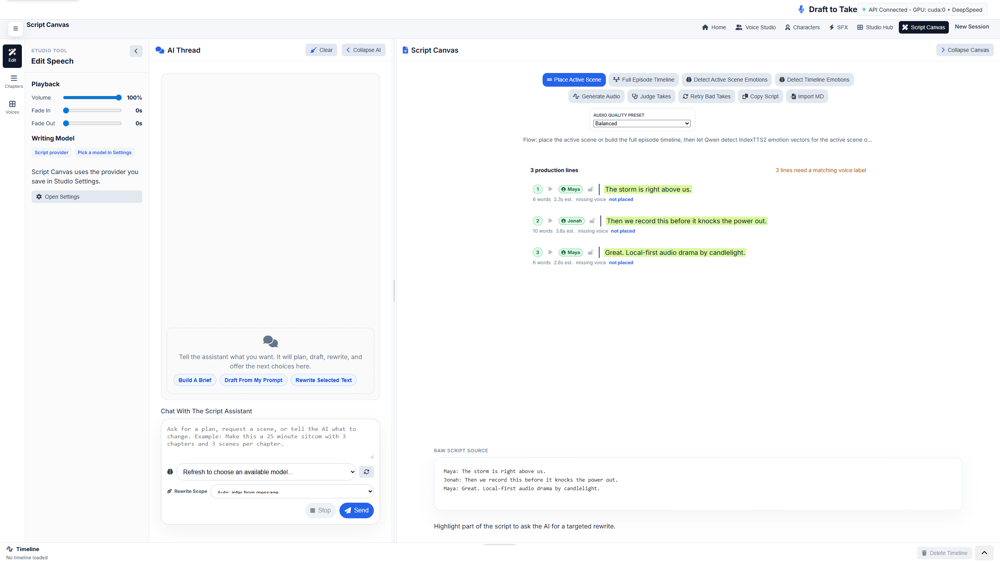
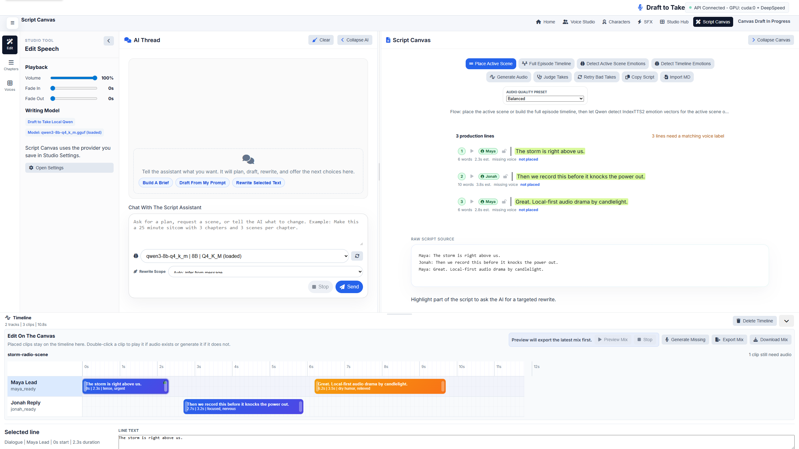
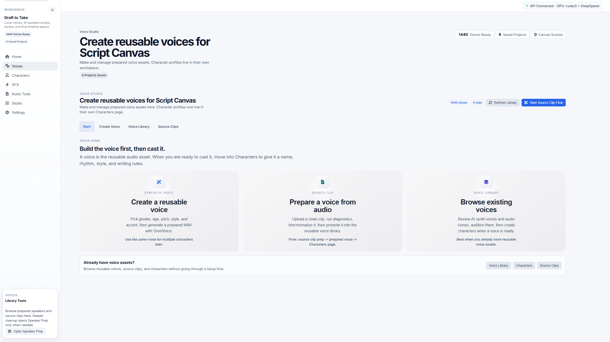

# Draft to Take Beta

Formerly **IndexTTS Workflow Studio**. This repository now hosts the Docker beta launcher for Draft to Take, the next-generation version of the original prototype.

[](https://github.com/sponsors/JaySpiffy)

Draft to Take is a local-first AI audio production studio for turning scripts into generated dialogue, reviewed takes, timeline clips, and exported mixes.

This beta repo contains the Docker launcher, configuration, diagnostics scripts, and tester docs. It does not contain the private source code or model weights. Docker pulls prebuilt beta images from GitHub Container Registry, then the app downloads supported model files into your own local machine.

Looking for the old prototype? The previous IndexTTS Workflow Studio code is preserved on the [`legacy-v2`](https://github.com/JaySpiffy/IndexTTS-Workflow-Studio/tree/legacy-v2) branch and the [`v2-legacy-final`](https://github.com/JaySpiffy/IndexTTS-Workflow-Studio/tree/v2-legacy-final) tag.

## App Preview


Prefer video playback? Open the [MP4 app preview](media/draft-to-take-20s-app-clip.mp4).

## Quick Run

Already have Docker Desktop running?

1. Download this repo as a ZIP.
2. Extract it somewhere simple, for example `C:\DraftToTakeBeta`.
3. Double-click `start.bat`.
4. Open the URL printed in the terminal, usually:

```text
http://localhost:3000
```

First launch can be slow because Docker images and model files are large. Keep the terminal open and let it finish.

## Screenshots

### Script Canvas

Draft, revise, assign speakers, detect emotions, and prepare production lines in one focused workspace.



### Script Canvas Timeline

The Script Canvas can place lines onto its built-in timeline drawer so you can review timing, generate missing takes, and export the mix without leaving the writing flow.



### Voice Studio

Prepare reusable voices, manage source clips, and keep cast-building separate from the main writing canvas.



## Beta Status

`v3.0.0-beta.7` is ready for a small closed beta with Docker-capable testers.

All beta container images are public and pullable from GitHub Container Registry:

- `draft-to-take-backend`
- `draft-to-take-frontend`
- `draft-to-take-script-llm`
- `draft-to-take-omnivoice`
- `draft-to-take-sfx`

## Who This Beta Is For

This first beta is best for people who are comfortable with Docker Desktop and local AI tools. It is not a one-click desktop installer yet.

Good testers:

- Run Windows 11 with Docker Desktop and WSL2.
- Have an NVIDIA GPU, ideally with 12-16 GB VRAM.
- Can tolerate large downloads and rough edges.
- Are willing to report bugs with hardware details and safe log excerpts.

## Requirements

- Windows 11 recommended.
- Docker Desktop with WSL2 enabled.
- NVIDIA GPU strongly recommended.
- NVIDIA Container Toolkit / Docker GPU support.
- 32 GB system RAM recommended for the full workflow.
- 12-16 GB VRAM recommended for the smoother local AI path.
- Plenty of disk space. First-run image pulls and model downloads can be many gigabytes.

CPU fallback can work for some paths, but it will be much slower.

## Quick Start

1. Download this repo as a ZIP or clone it.
2. Extract it somewhere simple, for example:

```text
C:\DraftToTakeBeta
```

3. Start Docker Desktop and wait until it is fully running.
4. Double-click:

```text
start.bat
```

5. Open the frontend URL shown in the terminal, usually:

```text
http://localhost:3000
```

First launch can take a while. Docker may pull large images, then the backend and sidecars may download large models. Keep the terminal open so you can see progress and errors.

## What Start.bat Does

The launcher:

- Creates `.env` from `.env.example` if needed.
- Creates a persistent shared folder under your Windows user profile.
- Checks whether Docker is running.
- Checks whether Docker can see your NVIDIA GPU.
- Pulls the prebuilt beta images.
- Starts the backend, frontend, Qwen sidecar, and OmniVoice sidecar.
- Leaves SFX/music disabled unless you opt in.

If ports `3000` or `8001` are busy, the launcher tries nearby ports and prints the actual URLs.

## Where Your Files Go

Your data is stored outside this release folder:

```text
%USERPROFILE%\DraftToTake\shared
```

That means you can delete and re-download this beta repo without losing downloaded models, voices, projects, or exported audio.

Important folders:

- `shared\models` - downloaded model files.
- `shared\models\checkpoints` - IndexTTS2 checkpoints and Hugging Face cache.
- `shared\models\llm` - Qwen GGUF files.
- `shared\audio\speakers` - prepared speaker WAV files.
- `shared\audio\source_clips` - raw clips you want to prepare.
- `shared\audio\outputs` - exported mixes.
- `shared\audio\sfx` - generated or imported SFX assets.
- `shared\audio\music` - generated or imported music assets.
- `shared\data` - app/project data.

## Models Used By This Beta

This beta does not bundle model weights. The launcher and containers download the configured models into your local shared folder or Hugging Face cache.

| Feature area | Default model/source | Enabled by default | Where it is stored | Notes |
| --- | --- | --- | --- | --- |
| Dialogue TTS | `IndexTeam/IndexTTS-2` | Yes | `shared\models\checkpoints` | Main Script Canvas and timeline speech generation. The upstream bundle includes the IndexTTS2 checkpoints, tokenizer/BPE assets, emotion and speaker matrices, and related vocoder/runtime files used by IndexTTS2. |
| Script assistant and emotion detection | `ufoym/Qwen3-8B-Q4_K_M-GGUF` / `qwen3-8b-q4_k_m.gguf` | Yes | `shared\models\llm` | Managed llama.cpp sidecar used by the optional AI Thread and by Qwen emotion-vector detection. |
| Reusable voice design | `k2-fsa/OmniVoice` | Yes | Hugging Face cache under `shared\models\checkpoints\hf_cache` | Creates prepared voice WAVs for the Voice Studio. Final dialogue rendering still uses IndexTTS2. |
| SFX and ambience | `AEmotionStudio/woosh-models`, default model `Woosh-DFlow` | No | `shared\models\woosh` | Optional SFX/music sidecar. `Woosh-Flow` can be selected as a slower quality option. |
| Music beds | `facebook/musicgen-small` | No | Hugging Face cache under `shared\models\checkpoints\hf_cache` | Optional music generation through the SFX/music sidecar. |
| Sound-cue alignment | `openai/whisper-tiny.en` | Lazy/optional | Hugging Face cache under `shared\models\checkpoints\hf_cache` | Used only when Whisper alignment is available and sound cue markers need word-timestamp alignment. |
| Speaker similarity checks | `speechbrain/spkrec-ecapa-voxceleb` and `funasr/campplus` / `campplus_cn_common.bin` | Lazy/optional | `shared\models\pretrained` and Hugging Face cache | Used for optional speaker similarity scoring and reranking during voice prep/quality checks. |
| Neural cleanup | DeepFilterNet via the `df` package | Lazy/optional | Docker cache volume / package cache | Used only when DeepFilterNet cleanup is selected or available through `auto` cleanup mode. Classic noise reduction can be used when it is unavailable. |

Most defaults can be changed in `.env`. The most useful model overrides are `INDTEXTS_MODEL_REPO`, `SCRIPT_LLM_MODEL_REPO_ID`, `SCRIPT_LLM_MODEL_FILENAME`, `OMNIVOICE_MODEL_ID`, `SFX_WOOSH_WEIGHTS_REPO`, `SFX_WOOSH_MODEL_NAME`, `MUSIC_MODEL_ID`, and `DRAFT_TO_TAKE_WHISPER_MODEL`.

## Enabled By Default

The beta starts these services by default:

- Main Draft to Take backend.
- Frontend UI.
- Managed Qwen sidecar, used for emotion detection and the optional AI Thread.
- OmniVoice sidecar, used for beta testing reusable voice design.

Qwen is enabled by default because emotion detection depends on it. You can turn off the AI Thread in the app settings if you do not want to use the experimental assistant workflow.

## Optional SFX And Music

SFX/music generation is disabled by default because the current model-backed generators are experimental, heavier, and license-dependent.

To test it, edit `.env` and set:

```text
INDTEXTS_SFX_ENABLED=true
```

Then run `start.bat` again.

Only enable SFX/music if your machine has enough VRAM and you understand that generated asset rights depend on the upstream model licenses and your use case.

## Updating The Beta

To update to a newer beta:

1. Run:

```text
stop.bat
```

2. Download the new beta repo ZIP or pull the latest repo.
3. Run:

```text
start.bat
```

Your shared folder under `%USERPROFILE%\DraftToTake\shared` is not deleted.

If a new release uses a new Docker image tag, check `.env` and update:

```text
DRAFT_TO_TAKE_IMAGE_TAG=v3.0.0-beta.7
```

## Stopping

Run:

```text
stop.bat
```

This stops containers but does not delete shared models, voices, projects, or outputs.

## Diagnostics

If something breaks, run:

```text
collect-diagnostics.bat
```

It writes a diagnostics text file under:

```text
%USERPROFILE%\DraftToTake\diagnostics
```

Review the file before posting it publicly. Do not share private scripts, voices, tokens, speaker samples, generated audio, or personal data unless you are comfortable doing so.

## Common Problems

### Docker Image Pull Failed

Make sure Docker Desktop is running and your network can reach GitHub Container Registry.

The images are public, so `docker login ghcr.io` should not be required for this beta.

### GPU Not Detected

The launcher will warn if Docker cannot see your NVIDIA GPU. Check Docker Desktop WSL2 integration and NVIDIA Container Toolkit support.

The app may continue in CPU mode, but generation will be much slower.

### First Start Looks Slow

This is expected on a fresh install. Docker images and model files are large. Keep the terminal open and watch the logs before assuming it has crashed.

### Frontend URL Does Not Open

Check the terminal output. If port `3000` was busy, the launcher may choose another port such as:

```text
http://localhost:3001
```

### Model Download Needs Authentication

Some upstream model downloads may require Hugging Face authentication depending on the model and account state.

If needed, edit `.env` and set:

```text
HF_TOKEN=your_token_here
```

Do not post your token in public issues or screenshots.

## Reporting Bugs

Use this repo's Issues tab.

Good bug reports include:

- Windows version.
- GPU model and VRAM.
- System RAM.
- Docker Desktop version.
- Whether Docker GPU support works.
- What you clicked.
- What you expected.
- What happened.
- A safe excerpt from the diagnostics file, if relevant.

Please do not upload private scripts, paid voices, private speaker samples, tokens, or sensitive generated audio to public issues.

## What To Test

Useful beta feedback includes:

- First-run setup problems.
- Model download problems.
- Voice preparation and speaker library issues.
- Single-line generation quality.
- Script Canvas workflow confusion.
- Timeline/export bugs.
- VRAM pressure or sidecar crashes.
- Places where the app looks frozen but is actually working.

## Model And License Notes

This beta does not sell, bundle, or grant rights to third-party model weights. The app may download models from official upstream sources into your local machine.

Read:

- [BETA_TERMS.md](BETA_TERMS.md)
- [THIRD_PARTY_NOTICES.md](THIRD_PARTY_NOTICES.md)

SFX/music model-backed generation is optional, experimental, and license-dependent.

## Privacy Note

Draft to Take is designed around a local-first workflow. Your scripts, speaker samples, generated audio, and projects stay in your local shared folder unless you choose to share them.

For beta support, only share the minimum logs and examples needed to reproduce a problem.
