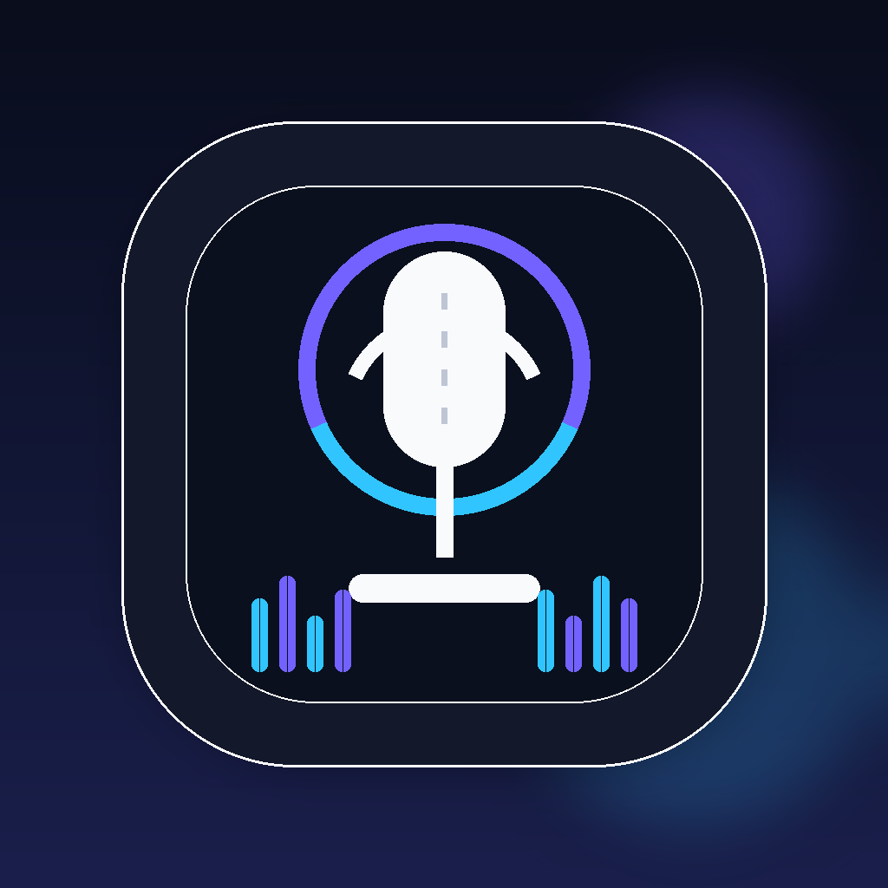
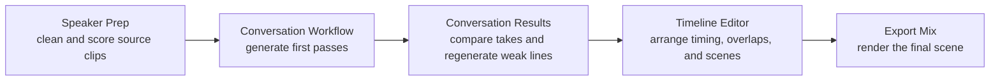
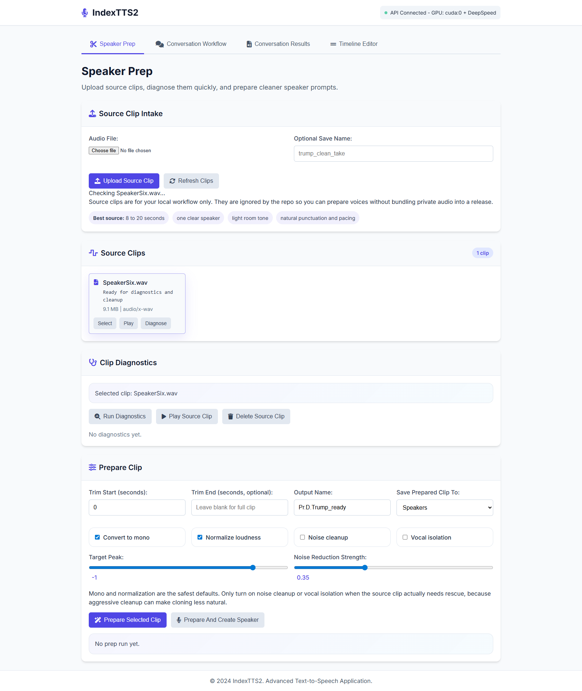
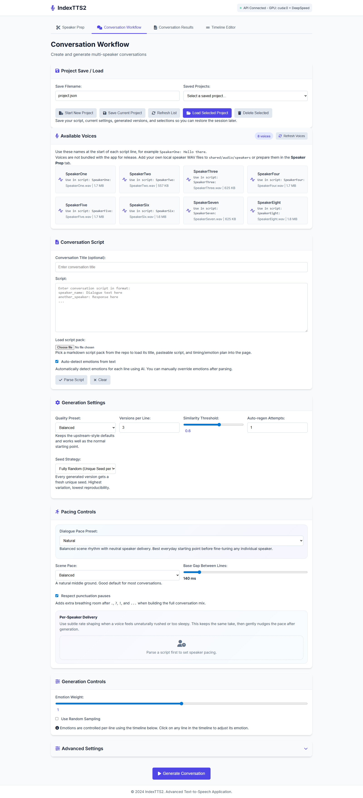
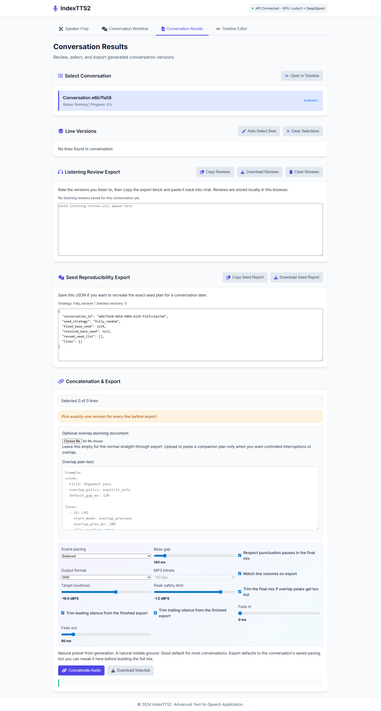
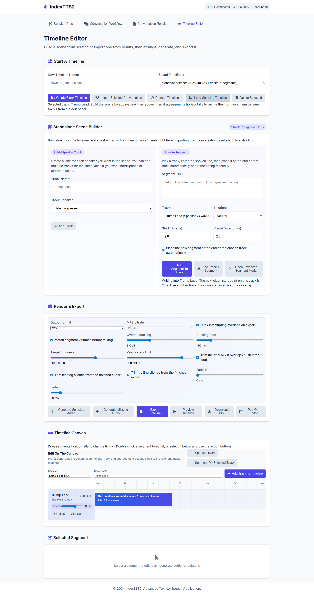

<div align="center">
  

# IndexTTS2 Workflow Studio

**Create natural, multi-speaker conversations with IndexTTS2 - fast.**

Turn scripts into realistic dialogue with speaker prep, line-by-line review, regeneration, timeline editing, and polished local export on top of the official IndexTTS2 models.

**Bring your own voices.** This repo does not ship bundled voice clones or private speaker files.

[](https://github.com/sponsors/JaySpiffy)
</div>

## Start In 2 Minutes

If you already have Docker and an NVIDIA-ready setup, the fastest path is:

1. Put your models in `shared/models/checkpoints`
2. Run `docker\start.bat`
3. Open [http://localhost:3000](http://localhost:3000)
4. Start in `Speaker Prep`, then move through `Conversation Workflow`, `Conversation Results`, and `Timeline Editor`

Good entry points:

- Demo scenes: [Hear What It Can Do](#hear-what-it-can-do)
- Quick start: [Quick Start](#quick-start)
- Manual with screenshots: [docs/manual/USER_MANUAL.md](docs/manual/USER_MANUAL.md)
- Docker details: [docker/README.md](docker/README.md)
- Contributing: [CONTRIBUTING.md](CONTRIBUTING.md)
- Security reporting: [SECURITY.md](SECURITY.md)

## Hear What It Can Do

If you want proof before setup details, start with three short scene demos rendered through this workflow:

| Demo | Play | What it shows |
| --- | --- | --- |
| Podcast roundtable | [Play in browser](https://github.com/JaySpiffy/IndexTTS-Workflow-Studio/raw/main/docs/assets/social/audio/podcast_roundtable_demo_pack.mp3) | Quick multi-speaker turn-taking and pacing |
| Audiobook night train | [Play in browser](https://github.com/JaySpiffy/IndexTTS-Workflow-Studio/raw/main/docs/assets/social/audio/audiobook_night_train_demo_pack.mp3) | Steadier narration with longer phrasing |
| Game dialogue checkpoint breach | [Play in browser](https://github.com/JaySpiffy/IndexTTS-Workflow-Studio/raw/main/docs/assets/social/audio/game_dialogue_checkpoint_breach_pack.mp3) | Tighter back-and-forth with more urgent timing |

These are public-safe sample scenes rendered from the local speaker library already used in the app.

## Workflow At A Glance



For a moving walkthrough, open the [timeline workflow clip](docs/assets/social/timeline-workflow-demo.webm).

## What This Repo Is

This repository is **not** the official IndexTTS model repository.

It is a practical local app built **on top of** the official IndexTTS ecosystem, with:

- `Speaker Prep` for cleaning and evaluating source clips
- `Conversation Workflow` for fast multi-speaker script generation
- `Conversation Results` for review, version selection, and regeneration
- `Timeline Editor` for scene timing, overlaps, and final arrangement
- a Docker-first local runtime with GPU-first behavior and CPU fallback

If you want the upstream project, papers, and hosted demos, use:

- Official code: [index-tts/index-tts](https://github.com/index-tts/index-tts)
- Official model: [IndexTeam/IndexTTS-2](https://huggingface.co/IndexTeam/IndexTTS-2)
- Official demo: [IndexTTS-2 Demo](https://huggingface.co/spaces/IndexTeam/IndexTTS-2-Demo)
- Paper: [arXiv 2506.21619](https://arxiv.org/abs/2506.21619)

## Why People Use It

This app is built for longer-form, practical TTS work rather than one-off single-line demos.

Example use cases:

- build a 3-speaker podcast or panel conversation
- create character dialogue for games, machinima, or visual novels
- generate narration with multiple takes, then compare and regenerate weak lines
- clean source clips before cloning so the voices sound more stable
- arrange interruptions, overlaps, and scene timing in a timeline before export

## Why This Workflow Is Different

| What you want to do | Where you do it | Why it matters |
| --- | --- | --- |
| Clean bad source audio before cloning | `Speaker Prep` | Better prompt clips usually mean better voice match, less noise, and fewer robotic takes |
| Turn a script into multi-speaker dialogue quickly | `Conversation Workflow` | Fastest path from script to first usable versions |
| Keep only the lines that actually sound right | `Conversation Results` | Review, compare, edit, regenerate, and lock final takes before export |
| Shape interruptions, timing, and full scenes | `Timeline Editor` | Useful when a plain linear conversation is not enough |

## Main Workspaces

### 1. Speaker Prep

- upload or select raw source clips
- trim, convert to mono, normalize, and clean noisy audio
- run quick clone-readiness diagnostics
- save the improved result into the live speaker library

### 2. Conversation Workflow

- paste a multi-speaker script
- see available voices clearly
- apply pacing presets
- parse, generate, and save project state

### 3. Conversation Results

- compare versions line by line
- play clips, compare clips, and review scores
- edit text during review
- regenerate weak lines
- export only after every line has a chosen final take

### 4. Timeline Editor

- build a scene directly in the timeline
- add speaker tracks and segments
- move segments in time
- shape overlaps and interruptions
- preview and export the final arranged scene

## Studio Preview

| Speaker Prep | Conversation Workflow |
| --- | --- |
|  |  |

| Conversation Results | Timeline Editor |
| --- | --- |
|  |  |

## Quick Start

### Recommended: Docker

This is the supported runtime path for this repo.

Default behavior:

- use your NVIDIA GPU when Docker can access it
- fall back to CPU only when GPU runtime is unavailable

1. Put your model files in:

```text
shared/models/checkpoints
```

2. Start the app:

```powershell
docker\start.bat
```

Or manually:

```powershell
docker compose -f docker/docker-compose.yml -f docker/docker-compose.gpu.yml up -d --build
```

3. Open:

- Frontend UI: [http://localhost:3000](http://localhost:3000)
- Backend API: [http://localhost:8001](http://localhost:8001)
- API docs: [http://localhost:8001/docs](http://localhost:8001/docs)

4. Add your own clips:

- finished cloning prompts -> `shared/audio/speakers/`
- raw clips for prep -> `shared/audio/source_clips/`

5. Work through the app in this order:

- `Speaker Prep`
- `Conversation Workflow`
- `Conversation Results`
- `Timeline Editor`

To stop the stack:

```powershell
docker\stop.bat
```

If `shared/models/checkpoints` is empty, the backend can automatically download the official IndexTTS2 model bundle on first start.

## Official Model Downloads

If you prefer to download the models yourself instead of using the app's automatic bootstrap, use the official upstream links:

- IndexTTS-2 on Hugging Face: [IndexTeam/IndexTTS-2](https://huggingface.co/IndexTeam/IndexTTS-2)
- IndexTTS-2 on ModelScope: [IndexTTS-2](https://modelscope.cn/models/IndexTeam/IndexTTS-2)

For this app, place the downloaded files in:

```text
shared/models/checkpoints
```

The app is built around **IndexTTS2**. Older upstream model releases exist, but this repo's current workflow and docs are centered on the v2 model line.

## What You Get Out Of The Box

- Docker-first startup with GPU-first behavior and CPU fallback
- DeepSpeed-enabled local inference path
- Speaker prep and diagnostics before cloning
- Multi-speaker script generation
- Review, regeneration, and final selection gating
- Timeline-based arrangement and scene export
- Project save/load for longer sessions
- Public demo scenes, screenshots, and short walkthrough videos
- Optional WebMCP website bridge for AI agents

## Community And Support

- Start with the pinned support issue for common first-run help and runtime fixes
- Use the built-in GitHub issue templates for bug reports, setup help, and feature requests
- Read [CONTRIBUTING.md](CONTRIBUTING.md) if you want to send changes back
- Read [SECURITY.md](SECURITY.md) for responsible vulnerability reporting

## AI / Agent Access

The web UI remains the main interface for human users.

For agent-style use, the frontend now includes an optional WebMCP bridge that can expose studio tools, prompts, and resources from the running website when the WebMCP script is available.

This is intended as a lightweight AI integration layer on top of the existing web app and API, not as a replacement for the normal UI.

## Hardware And Runtime Guidance

Practical guidance for a good local experience:

- NVIDIA GPU is strongly recommended
- CPU fallback works, but startup and generation are much slower
- at least `16 GB RAM`, `32 GB` recommended
- allow `50 GB+` disk space for models, caches, and outputs
- the first DeepSpeed-enabled startup can take longer while extensions warm up or compile

Today the Docker image is NVIDIA/CUDA-based. AMD and Apple GPU paths are not supported by this Docker image.

More runtime details: [docker/README.md](docker/README.md)

## Bring Your Own Voices

This app is intentionally **BYO voice**.

It does not include celebrity voices, personal voice libraries, or redistributable speaker packs.

Expected folders:

- `shared/audio/speakers/` - live speaker prompt files used by the app
- `shared/audio/source_clips/` - raw clips for cleanup and preparation
- `shared/audio/speakers_backups/` - backups of original speaker files before replacement

## Quality Tips

If a voice sounds too fast, robotic, or less faithful than expected:

- use the `Clone Fidelity` preset in the UI
- keep random sampling off
- use natural punctuation and sentence casing in the script
- prefer a clean `8 to 20 second` clip with one speaker and low background noise
- use `Speaker Prep` before blaming the model

There is also:

- a benchmark helper in [backend/scripts/quality_benchmark.py](backend/scripts/quality_benchmark.py)
- a listening review format in [docs/research/LISTENING_FEEDBACK_SYNTAX.md](docs/research/LISTENING_FEEDBACK_SYNTAX.md)
- a scripting guide in [docs/research/INDEXTTS2_SCRIPTING_PLAYBOOK.md](docs/research/INDEXTTS2_SCRIPTING_PLAYBOOK.md)

## User Manual And Walkthrough Videos

If you want a guided tour of the app before using it, start here:

- Full user manual with screenshots: [docs/manual/USER_MANUAL.md](docs/manual/USER_MANUAL.md)
- Speaker Prep video: [docs/assets/manual/videos/speaker-prep-tab.webm](docs/assets/manual/videos/speaker-prep-tab.webm)
- Conversation Workflow video: [docs/assets/manual/videos/conversation-workflow-tab.webm](docs/assets/manual/videos/conversation-workflow-tab.webm)
- Conversation Results video: [docs/assets/manual/videos/conversation-results-tab.webm](docs/assets/manual/videos/conversation-results-tab.webm)
- Timeline Editor video: [docs/assets/manual/videos/timeline-editor-tab.webm](docs/assets/manual/videos/timeline-editor-tab.webm)

## Example Script

```text
SpeakerOne: I think we should test three versions before we keep the final line.
SpeakerTwo: Good. If one sounds rushed, regenerate it and compare again.
SpeakerThree: After that, move the best takes into the timeline and export the scene.
```

## Important Directories

- `shared/audio/speakers/` - live speaker reference audio used for cloning
- `shared/audio/source_clips/` - raw clips for preparation or batch processing
- `shared/audio/speakers_backups/` - backups of original speaker files
- `shared/models/checkpoints/` - IndexTTS model files
- `shared/audio/outputs/` - exported outputs
- `shared/audio/temp_conversation_segments/` - per-line conversation audio
- `shared/audio/uploads/` - temporary imported files
- `shared/data/project_saves/` - saved conversation projects
- `shared/data/timeline_projects/` - saved timeline projects
- `frontend/` - browser UI
- `backend/` - FastAPI app plus wrapped IndexTTS runtime
- `docs/` - manuals, research notes, release docs, and supporting references
- `tools/` - maintenance helpers, manual capture scripts, and debug utilities
- `examples/` - reusable sample inputs and saved examples

## Container CLI Usage

If you want a CLI-style run without teaching users a host Python setup, use the backend container:

```powershell
docker compose -f docker/docker-compose.yml exec backend python backend/indextts/cli.py "Your text here" -v /app/shared/audio/speakers/YourVoice.wav -o output.wav --model_dir /app/shared/models/checkpoints -c /app/shared/models/checkpoints/config.yaml
```

## Docs

- Docs index: [docs/README.md](docs/README.md)
- User manual: [docs/manual/USER_MANUAL.md](docs/manual/USER_MANUAL.md)
- Docker guide: [docker/README.md](docker/README.md)
- Deployment guide: [docs/deployment/DEPLOYMENT_GUIDE.md](docs/deployment/DEPLOYMENT_GUIDE.md)
- API summary: [docs/api/API_README.md](docs/api/API_README.md)
- Known limitations: [docs/project/KNOWN_LIMITATIONS.md](docs/project/KNOWN_LIMITATIONS.md)
- Release readiness: [docs/project/RELEASE_READINESS_STATUS.md](docs/project/RELEASE_READINESS_STATUS.md)
- Audio folder guide: [shared/audio/README.md](shared/audio/README.md)

## Ready To Try It

If you want the shortest path from install to first result:

1. Start the stack with `docker\start.bat`
2. Open [http://localhost:3000](http://localhost:3000)
3. Prep or add a voice
4. Generate a short conversation
5. Review, regenerate, and export

## Credit

The underlying model technology, papers, and official pretrained checkpoints belong to the IndexTTS team. This repository packages those models into a more workflow-focused local application.

## Acknowledgements

- [index-tts/index-tts](https://github.com/index-tts/index-tts)
- [tortoise-tts](https://github.com/neonbjb/tortoise-tts)
- [XTTSv2](https://github.com/coqui-ai/TTS)
- [BigVGAN](https://github.com/NVIDIA/BigVGAN)
- [maskgct](https://github.com/open-mmlab/Amphion/tree/main/models/tts/maskgct)
