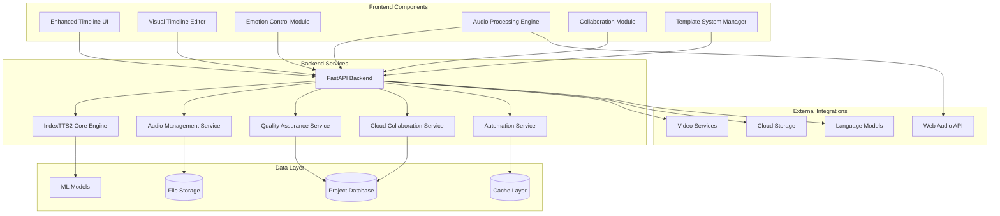
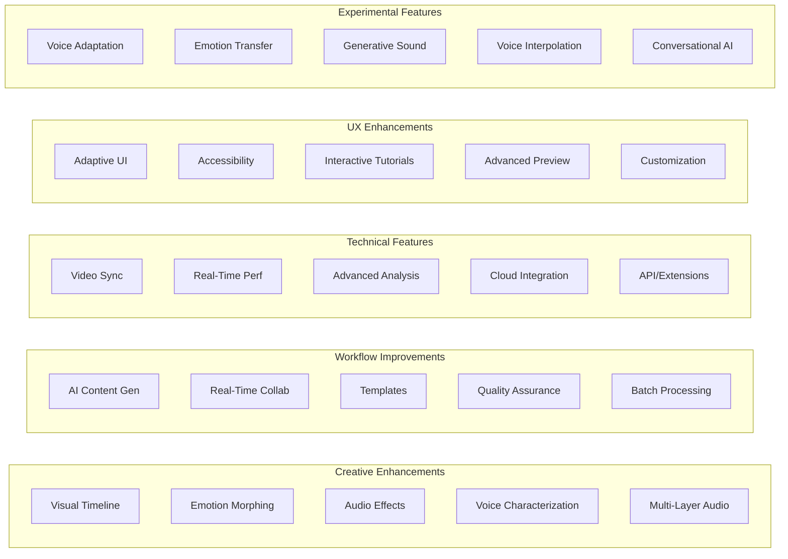
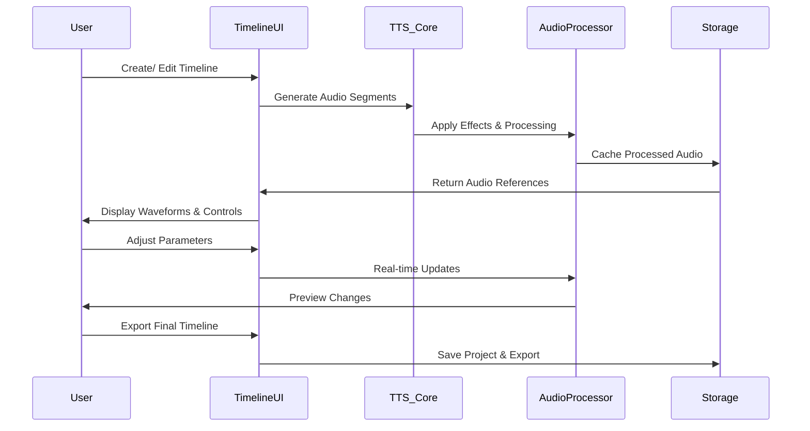
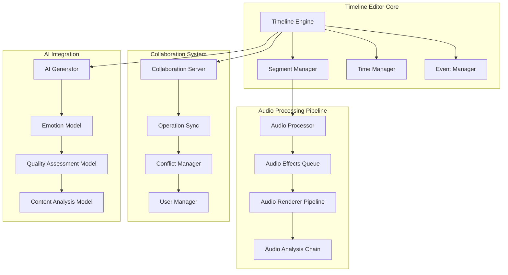

# Archived Timeline Architecture

This planning doc is kept for historical context only.

## System Architecture Overview



## Enhanced Timeline Feature Architecture



## Timeline Data Flow Architecture



## Component Interaction Diagram



## Enhanced Timeline User Experience Flow

```mermaid
journey
    title Enhanced Timeline User Journey
    section New User Onboarding
      Interactive Tutorial: 5: User
      Adaptive Interface: 4: User
      Guided Workflow: 5: User
    section Content Creation
      Visual Timeline: 5: User
      Emotion Control: 4: User
      AI Assistance: 4: User
    section Advanced Features
      Multi-Layer Audio: 3: User
      Video Synchronization: 4: User
      Collaboration: 4: User
    section Export & Sharing
      Quality Assurance: 5: User
      Multiple Formats: 4: User
      Cloud Integration: 3: User
